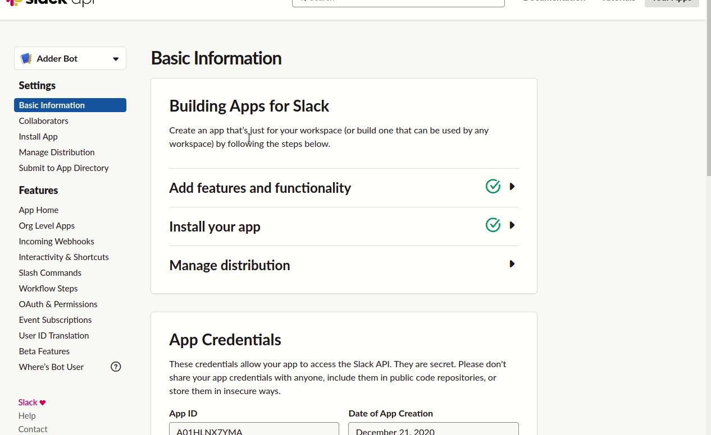

# Ruby-Addition-Bot

## Description

A simple Slack Bot that uses [Interactive Message Buttons](https://api.slack.com/legacy/message-buttons) to to evaluate mathematical expressions typed by a user on slack channels.

## Running the Sample

### Settings

Create `.env` file with the following settings.

```
SLACK_CLIENT_ID=...
SLACK_CLIENT_SECRET=...
SLACK_SIGNING_SECRET=...
SLACK_VERIFICATION_TOKEN=...
```

Get the values from from [your app's](https://api.slack.com/apps) _Basic Information_ settings.

Run `bundle install` and `foreman start`.

### Install App

Register your app via OAuth workflow from [localhost:5000](http://localhost:5000).

Expose the local server port 5000 to receive Slack events using [ngrok](https://ngrok.com).

```
ngrok http 5000
```

Copy the URL, e.g. `https://79f0f6335438.ngrok.io`, and use it as the prefix for your events, slash commands, and interactive message buttons.

### OAuth Scopes

See [config/initializers/slack_ruby_bot_server.rb](config/initializers/slack_ruby_bot_server.rb) for the required OAuth scopes. If you get `Slack::Web::Api::Errors::MissingScope: missing_scope` errors, you are missing a scope in your app configuration.

### Actions

Set the _Request Url_ in your app's Features under _Interactivity & Shortcuts_, e.g. `https://79f0f6335438.ngrok.io/api/slack/action`. Create an "on messages" shortcut, set the ID to `add-numbers`.



Create an "on messages" shortcut, set the ID to `count-letters`.

There's no need to invite the bot to a channel. Choose the "Count Letters" or "Evaluate Expression" shortcut, the bot will respond with an ephemeral message from
[lib/actions/count_letters.rb](lib/actions/count_letters.rb) or
[lib/actions/add_two_numbers.rb](lib/actions/add_two_numbers.rb).


A default handler is also fired on all other actions in [lib/actions/default.rb](lib/actions/default.rb) producing log output.

```
23:42:21 web.1  | I, [2020-07-19T23:42:21.394965 #78955]  INFO -- : Successfully connected team dblock (T04KB5WQH) to https://dblockdotorg.slack.com.
23:43:43 web.1  | I, [2020-07-19T23:43:43.978877 #78955]  INFO -- : Counting letters in "The red brown fox jumped over a lazy dog."
```

### Acknowledgements

- [Daniel Doubrovkine Awesome Readme Template](http://code.dblock.org)
- [slack-ruby-bot-server](https://github.com/slack-ruby/slack-ruby-bot-server)
- [Slack Official Documentation](https://slack.com/intl/en-ke/help/articles/115005265703-Create-a-bot-for-your-workspace)
